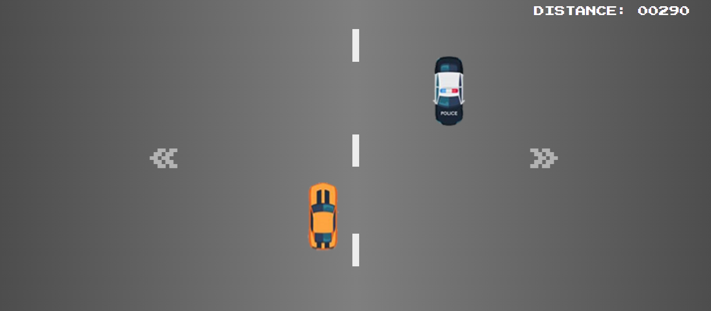

# SPEED RACING
👨‍💻JOGO DE CORRIDA DE CARROS COM HTML, CSS E JS.

  

## DESCRIÇÃO:
Esse é um **jogo de corrida** chamado "SPEED RACING". A ideia básica é que você controla um carro e precisa evitar colisões com outros carros enquanto avança pela pista e acumula pontos. 

## COMO O JOGO FUNCIONA?
1. **Criação e Movimentação de Elementos**:
   - **Faixas**: As faixas são criadas e movem-se verticalmente para simular o movimento da pista.
   - **Carros CPU**: Carros inimigos são gerados aleatoriamente na parte superior da tela e movem-se para baixo. A posição horizontal dos carros inimigos é aleatória, mas sua velocidade aumenta conforme o jogo avança.

2. **Contador de Pontos**:
   - O jogo conta a distância percorrida em metros e aumenta a pontuação à medida que o jogo avança. A dificuldade aumenta com o tempo, pois a velocidade dos carros inimigos e das faixas aumenta.

3. **Colisões**:
   - A função `impactCar()` verifica se o carro do jogador colidiu com qualquer carro inimigo. Se uma colisão for detectada, o jogo termina.

4. **Animações e Sons**:
   - Há animações para o movimento do carro do jogador e efeitos sonoros para o fundo e para o game over.

## JOGANDO:
1. **Início do Jogo**:
   - Clique no botão "JOGAR" para iniciar o jogo. Isso ocultará a tela inicial e começará o jogo.

2. **Controle do Carro**:
   - **Movimento para a Esquerda**: Clique no botão com a seta para a esquerda (`&laquo;`). O carro se moverá para a esquerda até alcançar o limite da tela.
   - **Movimento para a Direita**: Clique no botão com a seta para a direita (`&raquo;`). O carro se moverá para a direita até alcançar o limite da tela.

3. **Objetivo**:
   - Evite colisões com carros que aparecem na pista e acumule o máximo de pontos possível. O jogo mede a distância percorrida em metros, que é exibida na tela.

4. **Game Over**:
   - O jogo termina se seu carro colidir com outro carro. Quando isso acontece, a música de fundo para e uma música de "game over" é tocada. A tela exibirá a distância total percorrida.

5. **Reiniciar o Jogo**:
   - Após o game over, você pode clicar em "JOGAR NOVAMENTE" para reiniciar o jogo.

## NÃO SABE?
- Entendemos que para manipular arquivos em `HTML`, `CSS` e outras linguagens relacionadas, é necessário possuir conhecimento nessas áreas. Para auxiliar nesse aprendizado, oferecemos cursos gratuitos disponíveis:
* [CURSO DE HTML E CSS](https://github.com/VILHALVA/CURSO-DE-HTML-E-CSS)
* [CURSO DE JAVASCRIPT](https://github.com/VILHALVA/CURSO-DE-JAVASCRIPT)
* [CONFIRA MAIS CURSOS](https://github.com/VILHALVA?tab=repositories&q=+topic:CURSO)

## CREDITOS:
- [PROJETO CRIADO PELO "LucasMoura77"](https://github.com/LucasMoura77/CORRIDA)
- [PROJETO EDITADO PELO VILHALVA](https://github.com/VILHALVA)
